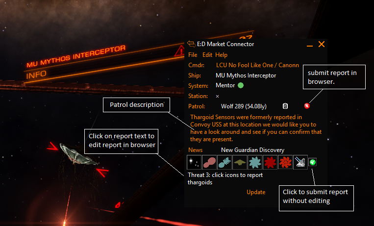

# USS Survey 
An EDMC Plugin that logs USS and Hyperdiction details through a google form to a spreadsheet.

* Displays nearest patrol system prioritise by least visited.
* User can click on patrol location to view in EDSM
* User can click on clipboard icon to copy to clipboard
* When a user drops on an USS the USS details are [logged](https://docs.google.com/spreadsheets/d/1_LsPtmXS7aUGYTJ-OomdE4gsYqkrYsmS7qzSpIUhQ4s/edit?usp=sharing)
* The user can manually [log additional information](https://docs.google.com/spreadsheets/d/1IA3HxotFUXh9qJi3v-wtcenvMF-znamfQ8JtNJbiZdo/edit#gid=1466834969) about the USS
* When a user is Hyperdicted the details are [logged](https://docs.google.com/spreadsheets/d/1grRDdXb6-6W1oxAVzPvvqTQDiVuExqAnvR97Q7cvrMA/edit?usp=sharing)
* The user can manually [log additional information](https://docs.google.com/spreadsheets/d/1IA3HxotFUXh9qJi3v-wtcenvMF-znamfQ8JtNJbiZdo/edit#gid=1466834969) about the Hyperdiction
* When a user arrives at a patrol destination their details are [logged.](https://docs.google.com/spreadsheets/d/1zlSh5fHg2ZM9fdLE4xl_GlPX0b0BFpbxarvKhRMUMi0/edit?usp=sharing)
* The patrol list is prioritissed to the the nearest least visitied system is offered to the user.
* Users arriving at a patrol system can log any unknown incidents on the Canonn incident form. 

# Survey Results

[USS results spreadheet](https://docs.google.com/spreadsheets/d/1_LsPtmXS7aUGYTJ-OomdE4gsYqkrYsmS7qzSpIUhQ4s/edit?usp=sharing)

[Hyperdiction results spreadheet](https://docs.google.com/spreadsheets/d/1grRDdXb6-6W1oxAVzPvvqTQDiVuExqAnvR97Q7cvrMA/edit?usp=sharing)

[Patrol Log spreadheet](https://docs.google.com/spreadsheets/d/1zlSh5fHg2ZM9fdLE4xl_GlPX0b0BFpbxarvKhRMUMi0/edit?usp=sharing)

# Installation
Download the [latest release](https://github.com/NoFoolLikeOne/EDMC-USS-Survey/releases/download/2_3/EDMC-USS-Survey.zip), open the archive (zip) and extract the folder  to your EDMC plugin folder.

Rename the folder to EDMC-USS-Survey

* Windows: `%LOCALAPPDATA%\EDMarketConnector\plugins` (usually `C:\Users\you\AppData\Local\EDMarketConnector\plugins`).
* Mac: `~/Library/Application Support/EDMarketConnector/plugins` (in Finder hold ⌥ and choose Go &rarr; Library to open your `~/Library` folder).
* Linux: `$XDG_DATA_HOME/EDMarketConnector/plugins`, or `~/.local/share/EDMarketConnector/plugins` if `$XDG_DATA_HOME` is unset.

You will need to re-start EDMC for it to notice the plugin.

